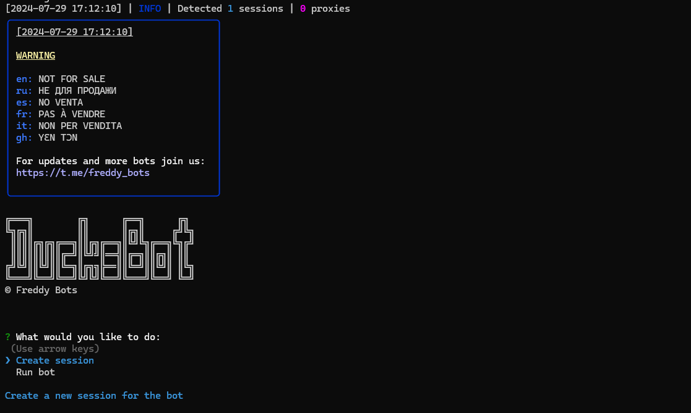

> [](https://t.me/roddyfred)



# Use Node.Js 18 or greater

## Functionality

| Functional                                                    | Supported |
| ------------------------------------------------------------- | :-------: |
| Claiming daily checkin                                        |    ✅     |
| Completing missions                                           |    ✅     |
| Multithreading                                                |    ✅     |
| Binding a proxy to a session                                  |    ✅     |
| Auto-purchase of items if you have coins (multitap, attempts) |    ✅     |
| Random sleep time between clicks                              |    ✅     |

## [Settings](https://github.com/FreddyWhest/DucksBot/blob/main/.env-example)

| Settings                   | Description                                                               |
| -------------------------- | ------------------------------------------------------------------------- |
| **API_ID / API_HASH**      | Platform data from which to launch a Telegram session (stock - Android)   |
| **AUTO_COMPLETE_MISSIONS** | Whether the bot should complete the missions (True / False)               |
| **AUTO_CLAIM_CHECKIN**     | Whether the bot should claim the daily checkin (True / False)             |
| **USE_PROXY_FROM_FILE**    | Whether to use proxy from the `bot/config/proxies.js` file (True / False) |

## Installation

You can download [**Repository**](https://github.com/FreddyWhest/DucksBot) by cloning it to your system and installing the necessary dependencies:

```shell
~ >>> git clone https://github.com/FreddyWhest/DucksBot.git
~ >>> cd DucksBot

#Linux and MocOS
~/DucksBot >>> chmod +x check_node.sh
~/DucksBot >>> ./check_node.sh

OR

~/DucksBot >>> npm install
~/DucksBot >>> cp .env-example .env
~/DucksBot >>> nano .env # Here you must specify your API_ID and API_HASH , the rest is taken by default
~/DucksBot >>> node index.js

#Windows
1. Double click on INSTALL.bat in DucksBot directory to install the dependencies
2. Double click on START.bat in DucksBot directory to start the bot

OR

~/DucksBot >>> npm install
~/DucksBot >>> cp .env-example .env
~/DucksBot >>> # Specify your API_ID and API_HASH, the rest is taken by default
~/DucksBot >>> node index.js
```

Also for quick launch you can use arguments, for example:

```shell
~/DucksBot >>> node index.js --action=1

OR

~/DucksBot >>> node index.js --action=2

#1 - Create session
#2 - Run clicker
```
